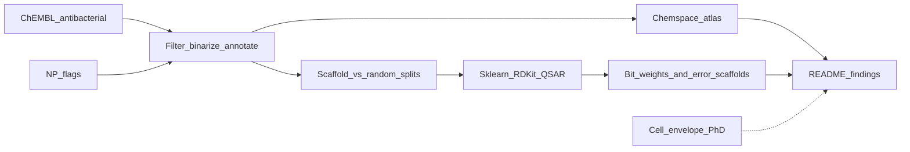

# abx_atlas

**Antibacterial chemical-space atlas** — reproducible, leakage-aware analysis of public ChEMBL data for cell-envelope targets.

> *A reproducible analysis of how chemical-space similarity, scaffold novelty, and dataset bias influence antibacterial QSAR performance—and whether natural products occupy underexplored regions of that space.*

## Question

**Can simple, leakage-aware models predict Gram-negative antibacterial activity labels from molecular structure alone, and where do they fail?**

Public labels are not pure molecular recognition: permeability, efflux, outer-membrane penetration, stability, and assay conditions all matter. The goal is not to claim structure alone “determines” activity, but to measure how much apparent performance survives when evaluation gets more realistic (scaffold novelty, time holdout), and to characterize the failure modes.

## Hypothesis

Cell-envelope / cell-wall–associated targets may occupy distinct chemical regions because they often require physicochemical properties compatible with **extracellular or periplasmic access** and with **macromolecular / lipid-facing interactions**, rather than only cytosolic binding.

The atlas and models test three related claims:

1. **Is the chemical space different?** — Do envelope-bucket compounds separate from other MoA buckets in fingerprint / scaffold space?
2. **Biology vs bias?** — Is any separation driven by target biology, or by dataset / assay / publication bias?
3. **Scaffolds vs mechanisms?** — Are classifiers learning chemotypes rather than generalizable activity signals?

## Why this exists

My PhD focused on acyltransferases as antibiotic-relevant targets.

This repo asks what **public bioactivity data** say about the chemistry that hits envelope-related targets, how **natural products** sit in that space (do they occupy underexplored antibacterial chemotypes?), and where **scaffold-split QSAR** still fails for Gram-negatives.

## What v1 ships

1. **Curated tables** — compounds × antibacterial labels × MoA bucket (`cell_envelope` / `other` / `unknown`) × NP flag  
2. **Atlas figures** — PCA of Morgan fingerprint space (MoA + NP overlays); **NP × envelope chemspace** (synthetic vs natural product with envelope highlight); Bemis–Murcko scaffold diversity; Gram+/− label balance  
3. **QSAR baselines** — logistic regression (interpretable) and random forest for **Gram-negative antibacterial labels** (pChEMBL ≥ 5)  
4. **Leakage analysis** — random vs scaffold vs time splits; quantify the optimistic gap  
5. **Interpretation** — scaffold-split logreg bit weights, column-shuffle bit importance, and scaffolds enriched in false positives / false negatives  
6. **One clear finding** — models look strong on random splits and typically degrade on novel scaffolds (classic chemogenomics hygiene)



## Scientific caveats

This analysis does **not** claim that chemical structure alone determines antibacterial activity. Public bioactivity datasets contain substantial assay heterogeneity, target annotation bias, and publication bias. Labels conflate on-target potency with permeability, efflux, and experimental conditions. Morgan-bit weights indicate associative patterns, not causal substructures. The goal is to quantify how much apparent predictive performance survives increasingly realistic evaluation settings—and to make those failure modes visible.

## Quickstart (CPU only)

```bash
python -m venv .venv && source .venv/bin/activate
pip install -e .
bash scripts/reproduce.sh
```

Or step-by-step:

```bash
abx-download --max-per-organism 5000   # ChEMBL API; capped for laptop runs
abx-atlas                              # figures → reports/figures/
abx-qsar                               # leakage + interpretation → data/processed/
```

Set `MAX_PER_ORG=0` (via `abx-download --max-per-organism 0`) for uncapped pulls.

## Layout

```
abx_atlas/
  README.md
  pyproject.toml
  src/abxatlas/
    data/          # ChEMBL fetch + cleaning + MoA/NP annotation
    featurize/     # Morgan FP, descriptors, Bemis–Murcko scaffolds
    atlas/         # chemspace stats + figures
    models/        # sklearn pipelines, splitters, interpretation
    resources/     # envelope-target keywords, Gram organism lists
  scripts/reproduce.sh
  reports/figures/
  LICENSE
```

## Methods (short)

| Piece | Choice |
|-------|--------|
| Source | ChEMBL activities with pChEMBL for priority Gram+/− pathogens |
| Active | pChEMBL ≥ 5 (≈ ≤ 10 µM) |
| Envelope bucket | Keyword match on target preferred name (Mur ligases, PBPs, LpxC, BamA/LptD, …); β-lactamases excluded |
| Features | Morgan FP (r=2, 2048 bits) via RDKit |
| Splits | Stratified random; Bemis–Murcko scaffold; earliest document-year holdout when available |
| Models | Logistic regression (baseline + coefficients); Random Forest |
| Interpretation | Top ± Morgan-bit logreg weights; column-shuffle importance on top |coef| bits; FP/FN scaffold enrichment on scaffold-split test |

Natural-product flags come from ChEMBL molecule annotations (optional COCONUT overlap can be layered later).

## Key outputs

| Artifact | Path |
|----------|------|
| NP × envelope PCA | `reports/figures/pca_np_vs_envelope.png` |
| Leakage ROC-AUC | `reports/figures/qsar_leakage_rocauc.png` |
| Logreg bit weights | `reports/figures/qsar_logreg_bit_weights.png` + `data/processed/qsar_logreg_bit_weights.csv` |
| Error scaffolds | `reports/figures/qsar_error_scaffolds.png` + `data/processed/qsar_error_scaffolds.csv` |

## Roadmap

- Optional later: LightGBM / graph models once baselines and leakage story are solid
- Bit-to-substructure highlighting (RDKit `GetOnBits` examples) for the strongest FP/FN motifs
