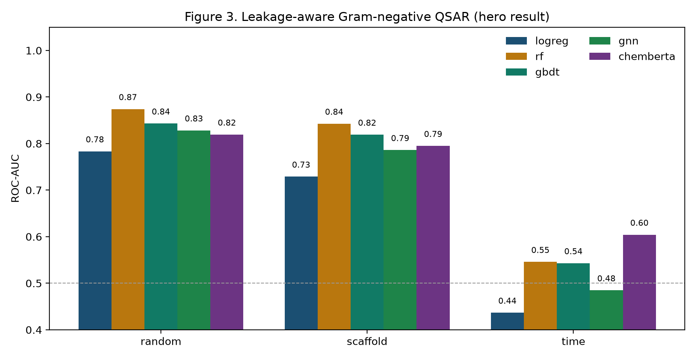
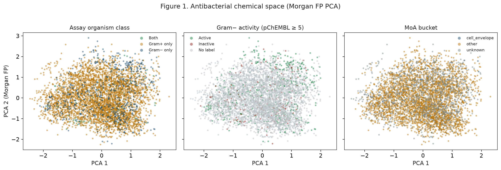
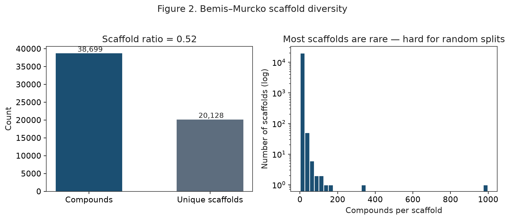
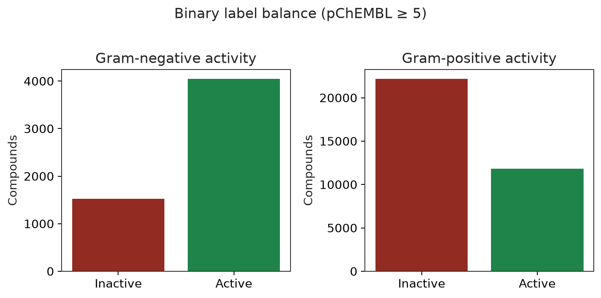
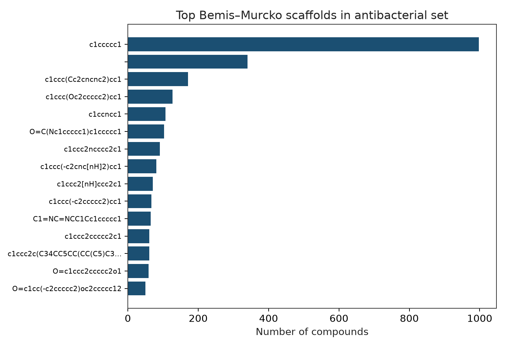
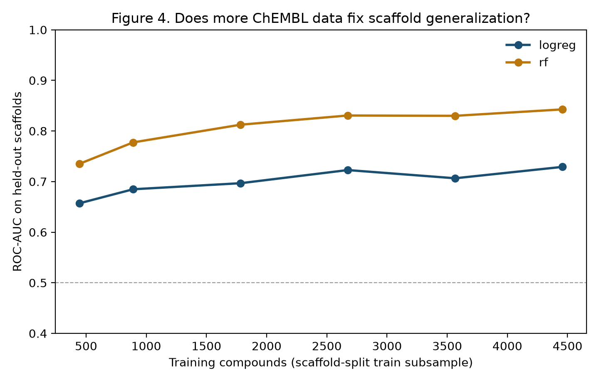
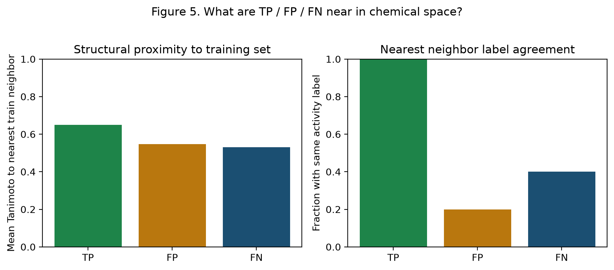
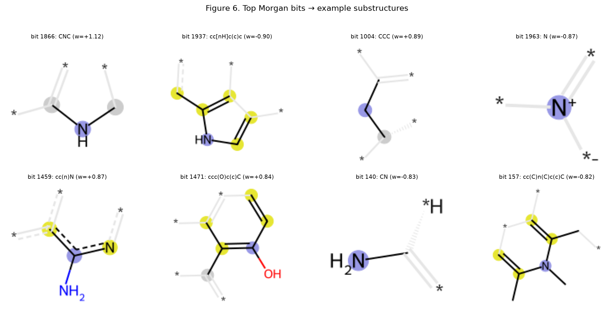
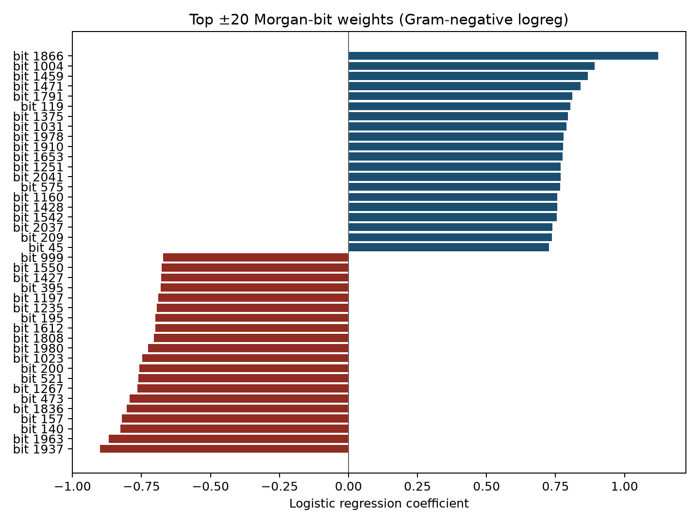
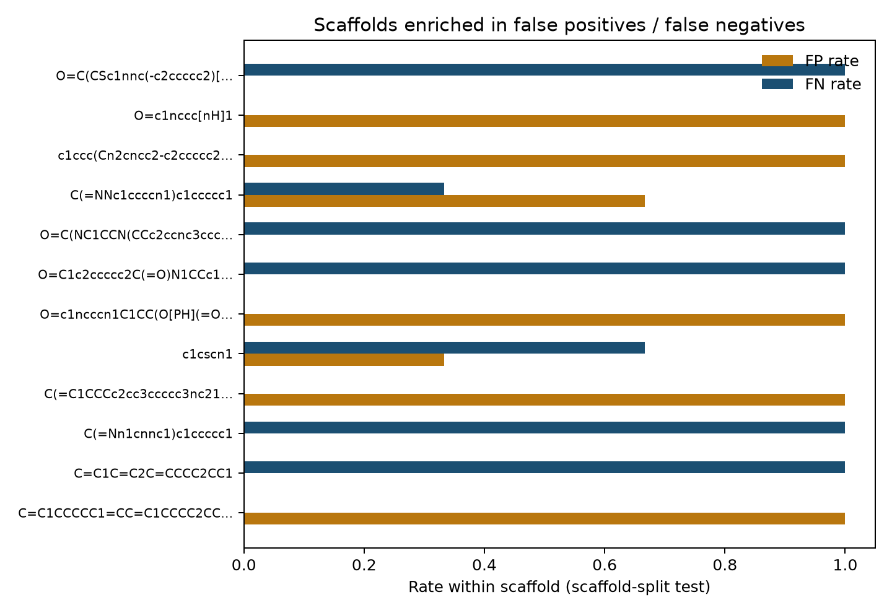

# abx_atlas

**A reproducible, leakage-aware benchmark of antibacterial QSAR on public ChEMBL data** — map antibacterial chemical space, train CPU and optional GPU models, and stress-test whether apparent Gram-negative activity prediction is really scaffold / time leakage rather than generalizable signal.

[](https://github.com/snowe36/abx_atlas/actions/workflows/ci.yml)
[](LICENSE)


Repo: [github.com/snowe36/abx_atlas](https://github.com/snowe36/abx_atlas)

---

## The problem

Public chemogenomics tables make antibacterial QSAR look easy: Morgan fingerprints + a random forest often post strong ROC-AUC on a random holdout. The harder ML question is:

**Can models predict Gram-negative antibacterial activity from structure alone — and how much of that apparent skill is really scaffold / time leakage rather than generalizable signal?**

This is an evaluation-hygiene / leakage-diagnostic problem with explicit negative controls (scaffold and temporal splits), not a leaderboard chase. Cell-envelope MoA labels motivated the project but are sparse at organism-level MIC scale; the main deliverable is the leakage story.

---

## What this repo builds

1. **Download & curate** ChEMBL antibacterial activities across a full Gram+/− organism panel
2. **Map** antibacterial chemical space (Morgan FP atlas, Bemis–Murcko scaffolds, MoA / NP panels)
3. **Benchmark** Gram-negative activity prediction under random, scaffold, and time splits
4. **Interpret** failures (bit weights → substructures, FP/FN scaffolds, nearest-train-neighbor Tanimoto)
5. **Ablate** against optional GPU deep models (from-scratch GNN + fine-tuned ChemBERTa) on the *same* splits — same protocol, honest comparison

<p align="center">
  
</p>

<p align="center"><em>Figure 3 (hero). Every model looks strong on a random split. Re-split by chemical scaffold or by publication year and the story changes — that gap <strong>is</strong> the finding.</em></p>

---

## Key results

| Check | Result |
|-------|--------|
| Curated antibacterial compounds | **38,699** · **20,128** scaffolds (ratio **0.52**) |
| Gram− labeled compounds (primary task) | **5,572** · active rate **0.73** |
| Random-split RF ROC-AUC (optimistic) | **0.87** |
| Scaffold-split RF ROC-AUC | **0.84** |
| Scaffold-split GBDT ROC-AUC | **0.82** (stronger than logreg; still trails RF) |
| Time-split RF / GBDT ROC-AUC | **~0.55** / **0.54** |
| Mean optimistic gap (random − scaffold, 5 models) | **~0.04** |
| Does a from-scratch GNN erase the leakage story? | **No** (scaffold 0.79; still trails RF) |
| Does fine-tuned ChemBERTa erase it? | **No** on scaffold (0.79); **strongest on time** (0.60) |
| Does more ChEMBL data fix scaffold generalization? | **Plateaus** (RF Δ ≈ +0.11 from 10%→100% train) |

---

## Quick start

Requires **Python 3.11+**:

```bash
git clone https://github.com/snowe36/abx_atlas.git && cd abx_atlas
python3.11 -m venv .venv && source .venv/bin/activate
pip install -U pip && pip install -e ".[dev]"
bash scripts/reproduce.sh && pytest -q
```

CPU pipeline (CI on every push):

```text
abx-download → abx-atlas → abx-qsar
```

Optional GPU step: `python scripts/runpod/launch_gpu_job.py` (GNN + ChemBERTa + HPO on RunPod), or locally `abx-qsar --with-gnn --with-pretrained` after `pip install -e ".[gpu]"`.

---

## Chemical space

Antibacterial compounds occupy **broad** Morgan-FP space with substantial scaffold diversity (~52% unique scaffolds). Most scaffolds are rare — exactly the setting where random splits leak.

| Item | Detail |
|------|--------|
| Source | [ChEMBL](https://www.ebi.ac.uk/chembl/) via `chembl-webresource-client` |
| Organisms | Full Gram+/− panel (**31** organisms; see `target_keywords.yaml`) |
| Keep | Records with `pchembl_value`; types MIC / IC50 / Ki / EC50 / IZ / Potency |
| Active | pChEMBL ≥ 5 (≈ ≤ 10 µM) |
| Features | RDKit Morgan FP (radius 2, 2048 bits); optional atom/bond graphs for the GNN |
| MoA bucket | Keyword match → `cell_envelope` / `other` / `unknown` |
| NP flag | ChEMBL `natural_product` (fetched by default) |
| Envelope-tagged | **354** compounds (still a minority — organism-level MIC assays rarely name molecular targets) |
| Natural products | **361** compounds (~0.9%) |

<p align="center">
  
</p>

<p align="center"><em>Figure 1. Morgan-FP PCA atlas — organism class, Gram− activity, and MoA bucket overlaid on the same space.</em></p>

<p align="center">
  
</p>

<p align="center"><em>Figure 2. Scaffold diversity — ratio 0.52, with a long tail of rare chemotypes (hard for random splits).</em></p>

<p align="center">
  
</p>

<p align="center"><em>Label balance at pChEMBL ≥ 5. The primary task (Gram−) is smaller and active-skewed; Gram+ has far more labeled compounds.</em></p>

<p align="center">
  
</p>

<p align="center"><em>Top Bemis–Murcko scaffolds — benzene dominates; most other scaffolds are far rarer.</em></p>

Full summary: [`data/processed/atlas_summary.csv`](data/processed/atlas_summary.csv).

---

## Leakage-aware QSAR

**Primary task:** binary Gram-negative activity (`gram_neg_active`).

**CPU baselines** (always on): logistic regression, random forest, and histogram gradient boosting (GBDT) on Morgan fingerprints.

**Splits (the point of the repo):**

| Split | What it tests |
|-------|----------------|
| Random (stratified) | Optimistic upper bound / leakage-prone |
| Scaffold (Bemis–Murcko) | Generalization to novel chemotypes |
| Time (earliest document year) | Prospective / publication-era shift |

CPU + GPU models on the expanded Gram− task (n=5,572). Deep models trained on RunPod (RTX A4000) with Optuna HPO (20 GNN trials, 6 ChemBERTa trials):

| Split | LogReg | RF | GBDT | GNN | ChemBERTa |
|-------|-------:|---:|-----:|----:|----------:|
| Random | **0.78** | **0.87** | **0.84** | **0.83** | **0.82** |
| Scaffold | **0.73** | **0.84** | **0.82** | **0.79** | **0.79** |
| Time | **0.44** | **0.55** | **0.54** | **0.48** | **0.60** |

<p align="center">
  
</p>

<p align="center"><em>Figure 3. Leakage-aware Gram-negative QSAR — RF leads on random/scaffold; GBDT sits between RF and logreg; ChemBERTa is strongest on the temporal holdout; none erase the drop.</em></p>

Mean optimistic gap (random − scaffold, all five models): **~0.04**. A stronger classical baseline (GBDT) and both deep models leave the leakage story intact — RF still leads on random/scaffold, while ChemBERTa is the strongest on the temporal holdout.

Full metrics: [`data/processed/qsar_leakage_results.csv`](data/processed/qsar_leakage_results.csv) · HPO configs: [`data/processed/qsar_meta.json`](data/processed/qsar_meta.json).

---

## Learning curves & interpretation

On held-out scaffolds, both CPU models improve with more train data then **plateau** (RF Δ ≈ +0.11, logreg Δ ≈ +0.07 from 10%→100% train). More ChEMBL rows alone do not erase chemotype / era bias.

<p align="center">
  
</p>

<p align="center"><em>Figure 4. Does more ChEMBL data fix scaffold generalization? RF plateaus ~0.84; logreg climbs more slowly.</em></p>

Interpretation on the scaffold-split logreg:

- False positives are often **structurally close** to actives in the training set (high Tanimoto to nearest neighbor) yet sit on **novel scaffolds** at test time
- Logreg bit weights and permutation importance highlight associative fingerprint patterns — not causal substructures
- Top bits are mapped back to **example Morgan environments** (fragment SMILES + RDKit bit highlights) so the coefficients are inspectable, not just IDs

<p align="center">
  
</p>

<p align="center"><em>Figure 5. What are TP / FP / FN near in chemical space? Correct calls sit closer to same-label train neighbors; errors do not.</em></p>

<p align="center">
  
</p>

<p align="center"><em>Figure 6. Top ± Morgan bits → example substructures (associative motifs, not mechanisms).</em></p>

<p align="center">
  
</p>

<p align="center"><em>Top ± Morgan-bit weights — associative fingerprint patterns, not causal substructures.</em></p>

<p align="center">
  
</p>

<p align="center"><em>Scaffolds enriched in FP / FN on the scaffold-split test — model blind spots by chemotype.</em></p>

**Takeaway:** apparent Gram− QSAR strength is partly **chemotype memorization** and **dataset era**. Scaffold- and time-aware evaluation makes that visible — and neither a stronger classical baseline (GBDT) nor the GPU models change that core finding.

---

## GPU: GNN + ChemBERTa ablation

After validating the CPU leakage story, ask whether architecture or pretraining changes the picture. Optional deep models are evaluated on the *same* random / scaffold / time splits:

| Model | Role |
|-------|------|
| **GNN** | From-scratch GCN/GIN on RDKit atom/bond graphs (`--with-gnn`) |
| **ChemBERTa** | Fine-tuned `seyonec/ChemBERTa-zinc-base-v1` on SMILES (`--with-pretrained`) |

Both get an [Optuna](https://optuna.org/) hyperparameter sweep rather than a single default-hyperparameter run.

**Locally (CPU smoke test — slow, good for catching bugs before spending GPU money):**

```bash
pip install -e ".[gpu]"
abx-qsar --with-gnn --gnn-epochs 5 --gnn-hpo-trials 0
```

**On a RunPod GPU pod (the real run):**

Prerequisites: RunPod account + billing, SSH public key on the account, API key in `.env` as `RUNPOD_API_KEY` (or `API_KEY`).

```bash
pip install -e ".[gpu]"
python scripts/runpod/launch_gpu_job.py
```

This creates a pod (default `NVIDIA RTX A4000`, ~$0.17–0.25/hr), syncs the repo + curated data, runs `abx-qsar --with-gnn --with-pretrained` with HPO, syncs CSVs/figures back, and **stops the pod immediately**. Typical full run: well under an hour, on the order of a few tens of cents to ~$1.

**Safety net:** every pod gets a hard self-terminating watchdog in `bootstrap.sh` (default **4 hours**) — independent of the local orchestrator, so a hung job or dropped SSH session can't leave a pod billing indefinitely.

| Flag | Default | Purpose |
|------|---------|---------|
| `--gpu-type-id` | `NVIDIA RTX A4000` | Any id from the RunPod console |
| `--max-runtime-hours` | `4` | Hard self-terminate backstop |
| `--gnn-hpo-trials` / `--pretrained-hpo-trials` | `20` / `6` | Optuna trial budget |
| `--keep-alive` | off | Leave pod up for interactive SSH (watchdog still applies) |
| `--terminate` | off | Delete the pod on completion instead of stopping it |

---

## Data

| Item | Detail |
|------|--------|
| Source | [ChEMBL](https://www.ebi.ac.uk/chembl/) activities |
| Organisms | 31 Gram+/− (full keyword list) |
| Raw assay rows | **47,213** |
| Curated assay rows | **47,099** |
| Compounds | **38,699** |
| Bemis–Murcko scaffolds | **20,128** (ratio **0.52**) |
| Gram− labeled | **5,572** · active rate **0.73** |
| Envelope MoA bucket | **354** |
| Natural-product flags | **361** |

Cite ChEMBL when using regenerated tables ([CITATION.cff](CITATION.cff)).

---

## Limitations

- Organism-level assays dominate; molecular MoA labels (esp. cell-envelope) are incomplete
- Labels conflate potency with permeability, efflux, stability, and assay conditions
- Keyword MoA bucketing is heuristic; β-lactamases are explicitly excluded from the envelope bucket
- Morgan bits indicate association, not mechanism
- The GNN is trained from scratch on this dataset alone — not a foundation model; HPO budget is small (tens of trials)
- ChemBERTa was pretrained on ZINC (purchasable / drug-like), not antibacterials — transfer quality is an empirical question this benchmark exposes, not assumes

---

## Future directions

- Integrate **COCONUT** / NPAtlas natural-product annotations
- Improve **mechanism-level labeling** (target family / UniProt / GO), not only name keywords
- Prospective **external validation** sets beyond ChEMBL time splits
- Attribution/explainability for the GNN (e.g. GNNExplainer) to extend the Figure 5–6 failure-analysis story
- Larger HPO budgets and a multi-task head (Gram− + Gram+ + MoA bucket jointly)

Done in v0.2: GBDT classical baseline · Morgan bit→substructure highlighting · committed metrics snapshots · fixture-based CI pipeline smoke test.

---

## How to reproduce (detail)

```bash
git clone https://github.com/snowe36/abx_atlas.git
cd abx_atlas
python3.11 -m venv .venv && source .venv/bin/activate
pip install -U pip && pip install -e ".[dev]"
bash scripts/reproduce.sh
pytest -q
```

Step by step:

```bash
abx-download --max-per-organism 20000 --all-organisms
abx-atlas
abx-qsar
```

Or via Make: `make lint` / `make test` / `make reproduce` (see [`Makefile`](Makefile)).

Optional GPU path:

```text
pip install -e ".[gpu]" → python scripts/runpod/launch_gpu_job.py
```

| Artifact | Path |
|----------|------|
| Fig 1 chemspace | `reports/figures/fig1_chemspace_atlas.png` |
| Fig 2 scaffolds | `reports/figures/fig2_scaffold_diversity.png` |
| Fig 3 leakage (hero) | `reports/figures/fig3_leakage_rocauc.png` |
| Fig 4 learning curve | `reports/figures/fig4_learning_curve.png` |
| Fig 5 neighbors | `reports/figures/fig5_error_neighbors.png` |
| Fig 6 bit→substructure | `reports/figures/fig6_morgan_bit_substructures.png` |
| Metrics (committed) | `data/processed/qsar_leakage_results.csv`, `atlas_summary.csv`, `qsar_meta.json` |
| Bit fragments | `data/processed/qsar_bit_substructures.csv` |

---

## Project layout

```text
src/abxatlas/        package (data, featurize, atlas, models, resources)
scripts/             reproduce.sh + runpod/ (GPU orchestrator + pod bootstrap)
data/raw|processed/  ChEMBL download + curated tables / committed metrics snapshots
reports/figures/     atlas + leakage + interpretation figures
tests/               unit + fixture pipeline smoke tests
.github/workflows/   CI (ruff + pytest)
```

---

## Acknowledgments

Bioactivity data from [ChEMBL](https://www.ebi.ac.uk/chembl/) (EMBL-EBI). Cite ChEMBL when redistributing regenerated tables — see [CITATION.cff](CITATION.cff).

---

## License

MIT
